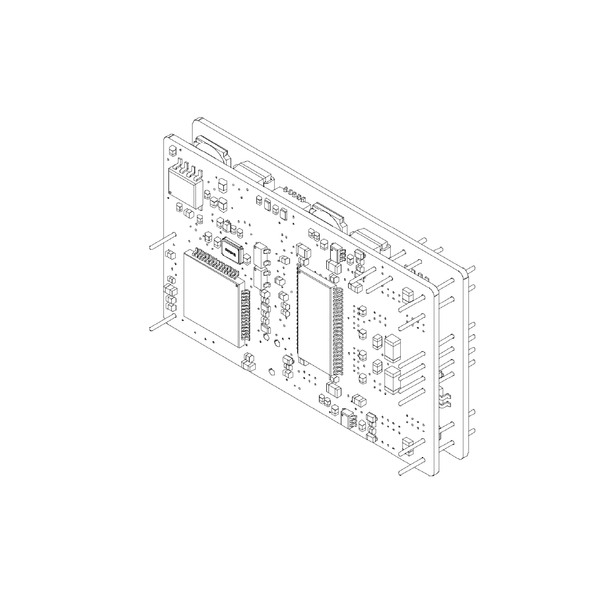

# Universal Motor Driver
This repository contains all files needed to order and build a motor driver which can be used with closed-loop stepper motors.

## Hardware
The driver is designed for board mount. THT pins are used for solder connection to a carrier board. Molex picoblade connectors are used for the encoder and CAN communication lines. These will be replaced by solder pins in a future revision.

## Software
Software features will be added continuously. Currently Microstepping and current control are implemented. Next added feature will be CAN communication. 

